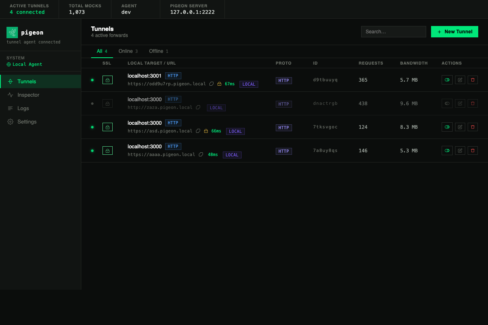

<h1 align="center">
   Pigeon
</h1>

<p align="center">
  <a href="https://goreportcard.com/report/github.com/bthe0/pigeon"></a>
  <a href="https://opensource.org/licenses/MIT"></a>
  <a href="https://github.com/bthe0/pigeon"></a>
  <a href="https://awesome.re"></a>
</p>

<p align="center">
  A lightweight, self-hosted tunnelling tool that exposes local services to the internet over <strong>HTTP</strong>, <strong>TCP</strong>, and <strong>UDP</strong> — no third-party services required.
</p>

<p align="center">
  
</p>

```
                  ┌─────────────┐        ┌─────────────┐
internet ────────▶│  pigeon     │◀──────▶│  pigeon     │◀────── localhost:3000
                  │  server     │  yamux │  daemon     │
                  │  (your VPS) │  mux   │  (your mac) │
                  └─────────────┘        └─────────────┘
```

---

## Features

- **HTTP tunnels** — expose any local HTTP server under a public subdomain
- **TCP tunnels** — forward raw TCP (Postgres, SSH, Redis, …)
- **UDP tunnels** — forward UDP traffic with per-source NAT-table multiplexing
- **TLS / Let's Encrypt** — automatic ACME certs on the server side
- **Background daemon** — persistent connection with exponential-backoff reconnect
- **Traffic logs** — structured NDJSON logs with `--since` / `--follow` / filter support
- **Web control panel** — manage tunnels, inspect logs, and restart the daemon from a browser
- **Geographic & Device Enrichment** — built-in web inspector automatically tracks requests via City, Country, OS, and Browser
- **Password Protection** — restrict tunnels using a web login form, or programmatically bypass via `?pigeon_password=` query params / Basic Auth
- **Local-dev mode** — run server + client locally with wildcard DNS and self-signed TLS
- **Zero dependencies on the client** — single static binary

---

## Installation

The easiest way to install Pigeon on macOS, Linux, or anywhere else is using Go's package manager:

```bash
go install github.com/bthe0/pigeon/cmd/pigeon@latest
```

*Note: Make sure the `$(go env GOPATH)/bin` directory is in your system `$PATH`.*

Or build from source:

```bash
git clone https://github.com/bthe0/pigeon.git
cd pigeon
go build -o pigeon ./cmd/pigeon
```

---

## Quick Start

The absolute fastest way to initialize your server and client is using the interactive setup tool:

```bash
pigeon setup
```

Otherwise, here is the manual guide:

### 1 — Run the server (on your VPS)

```bash
pigeon server \
  --token mysecret \
  --domain tun.example.com \
  --control :2222 \
  --http :80 \
  --https :443
```

| Flag | Default | Description |
|------|---------|-------------|
| `--token` | *(required)* | Shared auth secret |
| `--domain` | *(required)* | Base domain, e.g. `tun.example.com` |
| `--control` | `:2222` | Control-plane port |
| `--http` | `:80` | HTTP tunnel port |
| `--https` | `:443` | HTTPS port — enables ACME autocert |
| `--cert-dir` | `/var/lib/pigeon/certs` | Directory for ACME certificates |
| `--log` | stdout | Path to traffic log file |

### 2 — Init the client (on your machine)

```bash
pigeon init --server tun.example.com:2222 --token mysecret
```

This saves credentials to `~/.pigeon/config.json`.

### 3 — Add tunnel rules

```bash
# HTTP — auto-assigned subdomain
pigeon forward add http localhost:3000

# HTTP — custom subdomain
pigeon forward add http localhost:3000 --domain myapp.tun.example.com

# HTTPS upstream — local service already speaks TLS
pigeon forward add https localhost:8443 --domain secure.tun.example.com

# TCP — auto-assigned port
pigeon forward add tcp localhost:5432

# TCP — fixed remote port
pigeon forward add tcp localhost:5432 --port 5432

# UDP
pigeon forward add udp localhost:7777 --port 7777
```

### 4 — Start the daemon

```bash
pigeon daemon start
```

The daemon connects to the server, registers all configured forwards, and automatically reconnects on disconnect with exponential backoff.

---

## Commands

### `pigeon setup` — Interactive automated setup
```bash
pigeon setup
```
Provides an interactive setup wizard that configures Nginx routes, automatically installs and enables Systemd services for your relay server, and verifies connection stability during local client compilation.

### `pigeon server` — Run the tunnel server

```bash
pigeon server --token <tok> --domain <base-domain> [flags]
```

### `pigeon init` — Save server credentials

```bash
pigeon init --server <host:port> --token <tok>
```

### `pigeon forward` — Manage tunnel rules

```bash
pigeon forward add <http|https|tcp|udp> <local-addr> [--domain <d>] [--port <p>]
pigeon forward remove <id|domain|port>
pigeon forward list
```

### `pigeon web` — Start the configuration web interface

```bash
pigeon web --addr 127.0.0.1:8080
```
This opens a browser-based dashboard where you can:

- create, edit, enable, disable, and delete tunnels
- inspect recent logs in the browser
- restart the daemon from Settings
- use short local-dev hostnames like `myapp`, which normalize to `myapp.<base-domain>`

### `pigeon dev` — Run the full stack locally

```bash
sudo pigeon dev --token secret
sudo pigeon dev --domain pigeon.local --token secret
```

Local-dev mode:

- generates a self-signed certificate for `<domain>` and `*.<domain>`
- starts the relay server locally on `127.0.0.1:2222`, `:80`, and `:443`
- configures wildcard DNS via `/etc/resolver/<domain>`
- writes client config so the daemon and web UI use the local relay automatically

### `pigeon dev trust` — Trust the local dev certificate on macOS

```bash
sudo pigeon dev trust
sudo pigeon dev trust --domain pigeon.local
```

This adds the generated self-signed certificate from `~/.pigeon/dev-certs/cert.pem` to the macOS System keychain.

### `pigeon daemon` — Manage the background process

```bash
pigeon daemon start    # fork daemon to background
pigeon daemon stop     # send SIGTERM
pigeon daemon restart  # stop + start
pigeon daemon status   # print PID / stopped
```

### `pigeon status` — Show overall status

```bash
pigeon status
# Daemon: running (PID 12345)
# Server:   tun.example.com:2222
# Forwards: 3 configured
#   abc12345  http  localhost:3000 → myapp.tun.example.com
#   def67890  tcp   localhost:5432 → port 5432
```

### `pigeon logs` — Inspect traffic

```bash
pigeon logs                    # all entries
pigeon logs <forward-id>       # filter by forward
pigeon logs --since 1h         # last hour only
pigeon logs --limit 50         # cap output
pigeon logs --follow           # tail -f style
```

---

## How It Works

```
External request
      │
      ▼
pigeon server  (public VPS)
  ├── Control plane (:2222) — yamux-multiplexed TCP
  │     auth → forward registration → ping/pong keepalive
  ├── HTTP plane  (:80/:443) — reverse proxy per-subdomain
  └── TCP/UDP listeners — one port per registered forward
      │
      │  yamux stream (data plane)
      ▼
pigeon daemon  (your machine)
  ├── HTTP  → dial localhost:PORT, proxy stream
  ├── TCP   → dial localhost:PORT, io.Copy both ways
  └── UDP   → NAT table: one local socket per external client
              replies stamped with original source addr
```

All data flows over a single multiplexed TCP connection ([yamux](https://github.com/hashicorp/yamux)) so only outbound port 2222 needs to be open on the client.

---

## Running Tests

```bash
go test ./...
```

All packages have unit tests. The `tools/` directory contains standalone echo servers and clients for manual end-to-end testing:

```bash
# TCP echo server / client
go run tools/tcpecho/main.go
go run tools/tcpclient/main.go localhost:<port> "hello"

# UDP echo server / client
go run tools/udpecho/main.go :19201
go run tools/udpclient/main.go localhost:<port> "hello"
```

---

## File Layout

```
pigeon/
├── cmd/pigeon/main.go          # CLI (cobra commands)
├── internal/
│   ├── proto/                  # Length-prefixed JSON wire protocol
│   ├── server/                 # Tunnel server (control + HTTP + TCP/UDP)
│   └── client/                 # Daemon, config, logs, tunnel client
├── tools/                      # Manual E2E echo helpers
└── assets/                     # Branding / design assets
```

---

## License

MIT
